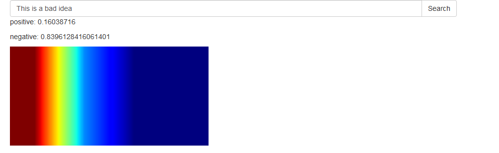
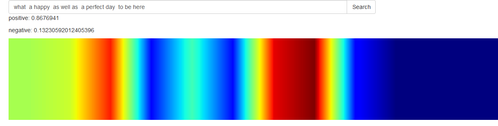
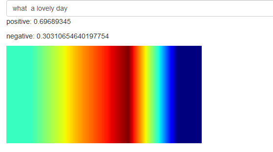

It is Keras implementation based on  Kim's [Convolutional Neural Networks for Sentence Classification](http://arxiv.org/abs/1408.5882) paper .

## Requirements

- Python 3
- Tensorflow > 1.6.0
- keras  2.1.6
- Numpy
- Flask (Optional,for server)

## Training

Training procedure is described in training.ipynb file.


Print parameters:


```
 arguments in multichannel_drop:
        
  EMBEDDING_DIM
                        Dimensionality of character embedding (default: 100)
  FILTER_SIZES
                        hard-coded,Comma-separated filter sizes (default: '2,3,5')
  NUM_FILTERS
                        hard-coded,Number of filters per filter size (default: 100)
  
                        
   DROP
                        Dropout keep probability (default: 0.5),
  
  

```
Haven't used regularisation.

## Pretrained Weights

 Located in weights directory,along with embedding matrix   used for data in data/ directory


## Basic visualisation

Basic visualistaion procedure is described in visualisation.ipynb file. 

For interactive visualisation run server 

<div align="center">



</div>

## Server 

```bash
python server.py

```

Go to the address "127.0.0.1:8000/static/nlp.html" using browser .

## References

- [Convolutional Neural Networks for Sentence Classification](http://arxiv.org/abs/1408.5882)


